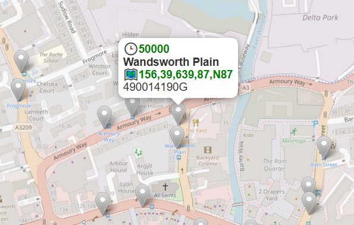
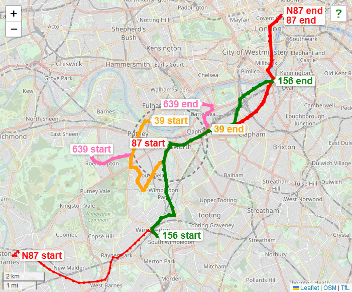

# London Bus Spider Map

Combines Leaflet.js and data from Transport for London open APIs to draw geographical-ish maps of bus routes from any TfL-managed London bus stop.

## Setup Instructions

1. Stick all the files in a directory on a web server.
2. Run the script `convert.py` to fetch the latest data from the TfL API and convert it to an SQLite database.
3. The two `.csv` files are no longer required and can be deleted.

## How to Use

Browse to `index.html` in a web browser.

Zoom in to the area of interest; once you zoom in close enought it'll display bus stops in that area.

Click on a bus stop to pop up its information.

Clicking the code labelled 🕒 will take you to live info at bustimes.org (I'm not affiliated with them in any way, it's just a really useful website).

Clicking the list of route numbers labelled 🗺️ will overlay a spider diagram of services to/from that stop.

Clicking the `?` icon should zoom/pan the map to your current location, if available.

## Known Issues

The route lines don't follow roads, they just join bus stops together with straight lines. I could do it properly, but it looks like that would involve a lot more API calls to get the route data, and possibly impact performance.

It may run out of colours, if there's a stop with more routes than I've accounted for.

Once you get out near the M25, some stops and routes aren't shown; I suspect these aren't managed by TfL.

The algorithm that orients start/end labels isn't perfect, for example it doesn't account for nearby route lines that bypass the labelled stop, and doesn't make any effort to avoid overlapping labels.

Bus stops are fetched from the server API with every pan/zoom of the map, if this is to be deployed widely there ought to be some caching going on in the JS.

This was written to scratch a personal itch, so the usual caveats about code quality apply 😅

## License

Code is copyright by Tyrone C. and made available under the MIT license, the text of which can be found in the `LICENSE.md` file in this repository. I heartily encourage all sites carrying public transport info to rip off this idea.

